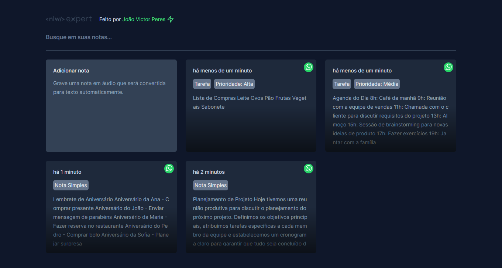

# Notes App

Este é um projeto desenvolvido durante a NLW Expert utilizando ReactJS para criar um aplicativo de notas.

O App oferece uma maneira fácil e eficaz de criar, editar e gerenciar suas notas de forma digital, desenvolvido utilizando as mais recentes tecnologias web para fornecer uma experiência de usuário moderna e responsiva.

No momento é possível criar as notas de duas formas: digitando texto ou gravando áudio utilizando a biblioteca Web Speech API, que é posteriormente também é convertido para texto.

## Recursos

- **Criação de Notas:** Os usuários podem criar notas digitando texto ou gravando áudio.
- **Edição de Notas:** Foi implementado a funcionalidade de edição de notas para que os usuários possam modificar o seu conteúdo, tipo e prioridade.
- **Exclusão de Notas:** Os usuários podem excluir notas localmente.
- **Campos Adicionais:** Foram adicionados campos de tipo e prioridade para cada nota, permitindo uma categorização mais detalhada.
- **Compartilhamento:** Uso da biblioteca `react-share` para facilitar o compartilhamento das notas via WhatsApp, possibilitando o encaminhamento de seu conteúdo tipo e prioridade.
- **Estilização:** A TailwindCSS foi utilizada par estilização do aplicativo, garantindo uma aparência moderna e responsiva.
- **Tratamento de Datas:** Uso da biblioteca `date-fns` para manipulação e formatação de datas, considerando o dia e hora da criação de uma nota, por exemplo.
- **Notificações Personalizadas:** Com uso da biblioteca `sonner`, foi possível notificar o usuário após diversas ações no aplicativo, como criar, excluir, editar uma nota ou ao não realizar o preenchimento esperado.
- **Inserção de imagem:** Para cada nota pode ser adicionada uma imagem como complemento. No momento, essa imagem não é enviada para o WhatsApp ao compartilhar.

## Tecnologias Utilizadas

- ReactJS
- Web Speech API
- TailwindCSS
- date-fns
- react-share
- radix
- sonner

## Como Usar

1. Clone o repositório.
2. Instale as dependências utilizando `npm install`.
3. Inicie o servidor de desenvolvimento com `npm run dev`.
4. Acesse o aplicativo em seu navegador.

## Resultado

O aplicativo Notas App também está disponível online, clicando [aqui](https://nlw-expert-notes-app.vercel.app/) o resultado pode ser conferido.
